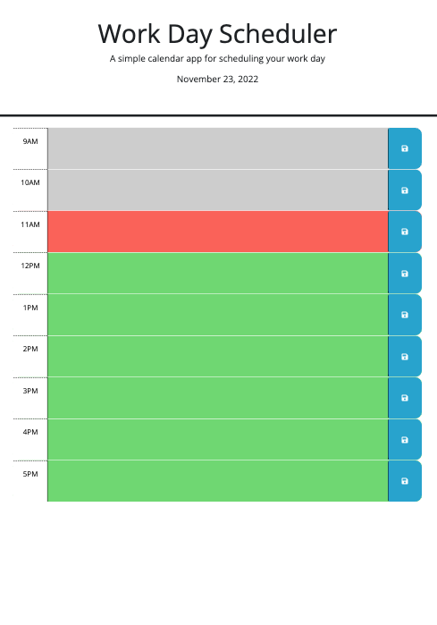

# day_scheduler

## Description

This day scheduler uses JQuery features to allow a user to save tasks for each hour of the work day (9AM-5PM). 

## Installation

N/A

## Usage

When a user saves a task to a given hour, the task is saved into local storage and remains displayed on the screen even if the user clicks the refresh button of the browser. The day scheduler displays the current day at the top of the page. It also color codes each time block to indicate to the user if the time is in the past (gray), present (red), or future (green).

[Day Scheduler](https://annaperlack.github.io/day_scheduler/)

## Credits

N/A

## License

N/A